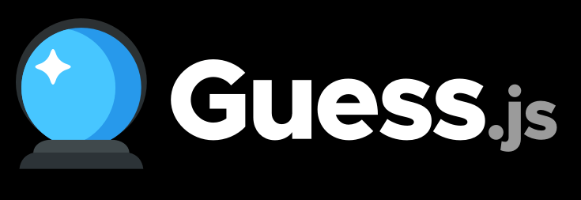

# Guess.js logos and artwork

> Logo guidelines and assets for Guess.js can be found in this repo.

## Name

Guess.js should always be written in Propercase, capitalizing the G. Please refer to Guess.js with the .js file extension (e.g not GuessJS).

## Logo variations

### Vertical logo

### Horizontal logo

## Dark background

## Typography

Guess.js uses the ExtraBold variant of the [Metropolis](https://www.fontsquirrel.com/fonts/metropolis) font.

## Design queries

Feel free to reach out if you have design feedback/suggestions via the issue tracker.